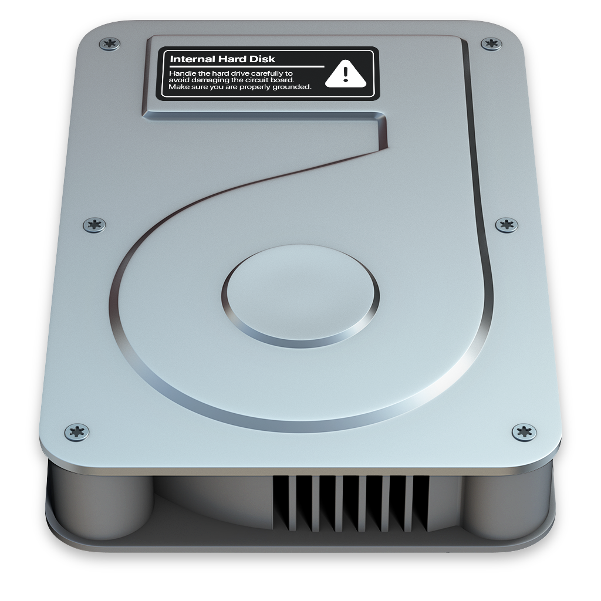

<p align="center">
	
</p>

## À propos

Ce site Internet mélange le fonctionnement et le contenu d'un **site personnel** et d'un **site professionnel**, permettant d'avoir **une seule référence complète**, que ce soit pour la famille, des amis, des inconnus, mais aussi des recruteurs et des collègues. Cette ressource permet de montrer des **projets**, des **outils**, des **compétences**, mais également de mieux comprendre **ce que j'aime** !

## Fonctionnalités

- **Interface :** style simple, épuré et moderne
- **Projets :** affichage des projets, de leurs technologies, de leurs catégories et bien plus
- **Blog :** affichage des articles
- **Ressources :** affichage des annonces rapides et des différents téléchargements disponibles
- **Médias :** affichage de vidéos YouTube, de photos prises, de musiques écoutées et de jeux joués
- **Outils :** affichage des différents systèmes d'exploitations et logiciels utilisés
- **Espace recruteur :** affichage dee certains projets, des compétences, de l'historique de CV génériques, des langues et de moyens de contact

## Installation

### Clonez le dépôt

````bash
git clone https://github.com/enioaiello/portfolio-laravel.git
````

## Contribution

Vous pouvez utiliser les [Issues](https://github.com/enioaiello/portfolio-laravel/issues) pour soumettre une idée ou signaler un problème.

## Soutiens

Si vous aimez ce projet, considérez à faire un don sur ma page [GitHub Sponsors](https://github.com/sponsors/enioaiello).

## Licence

Ce projet est distribué sous la licence MIT. Pour consulter cette licence, veuillez consulter le fichier [LICENSE](license).
